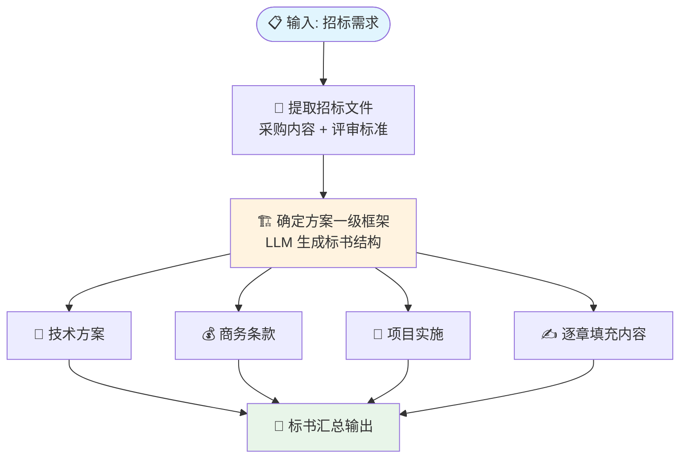

# 智能标书写作助手

> 根据需求生成专业标书

根据用户需求自动生成专业化标书文档，覆盖技术方案、商务条款、项目实施等核心板块。

## 工作流架构



### 设计要点

- **两步生成**：先定框架再填内容，保证结构完整性和逻辑一致性
- **模块化输出**：技术方案、商务条款、项目实施独立生成，可灵活调整
- **招标文件驱动**：基于实际招标要求提取关键信息，而非凭空生成

## 功能特性

- 根据项目需求智能生成标书框架
- 自动填充技术方案与商务条款
- 支持标书章节级精细化调整
- 保证格式规范与专业性

## 项目结构

```
├── README.md
├── .gitignore
├── agent/
│   ├── prompt.md              # 主提示词
│   ├── workflow-prompts.md    # 工作流内嵌 Prompt
│   └── config.yaml
└── workflows/
    └── biaoshu_qing.yaml
```

## 平台

基于 [Coze（扣子）](https://www.coze.com) 构建。

## 快速体验

👉 https://www.coze.cn/s/YihbUEJxEVs/
